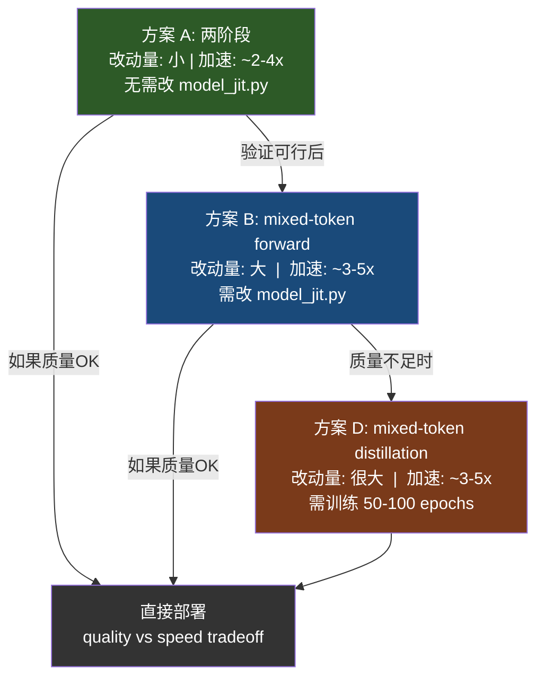

# Stage 2 负加速问题：解决方案深度分析

## 问题回顾

原始计划的 `_mixed_proxy_forward()` 在 Stage 2 里同时调用了 full-res JiT 和 low-res JiT：

```python
def _mixed_proxy_forward(self, z_full, t, labels, mask_full, low_net):
    v_full, _ = self._cfg_v_and_x(self.net, z_full, t, labels)   # ← full cost!
    v_low, _ = self._cfg_v_and_x(low_net, z_low, t, labels)      # ← extra cost!
    v = mask_full * v_full + (1 - mask_full) * v_low
```

每一步 Stage 2 的代价 = **1 full forward + 1 low forward**，比原始的 1 full forward 还贵。

### 量化分析

以 JiT-B/16 256px 为例（`patch_size=16`, `G=16`, `num_patches=256`）：
- **full forward token 数**：256 + 32 in-context = 288 tokens
- **low forward token 数**（f0=2, 128px）：64 + 32 in-context = 96 tokens
- Attention 复杂度 ∝ N²：full ≈ 288² = 82,944，low ≈ 96² = 9,216

| 方案 | Stage 2 每步代价（相对 1 full） | 说明 |
|------|------|------|
| 原始 MVP | ≈ 1.11x | 1 full + 1 low (low ≈ 0.11x full) |
| 只用 full | 1.0x | 原始 JiT 做法 |
| 只用 low | ≈ 0.11x | 质量差 |
| **真正 mixed-token** | **≈ 0.23-0.48x** | 取决于 up_ratio |

> [!IMPORTANT]
> 问题的本质：**不可能在不修改 `model_jit.py` 的情况下实现真正的空间稀疏加速**。JiT 的 `forward()` 只接受固定分辨率的图像输入，必须改成 token-level 接口才能让 token 数真正减少。

---

## 方案 A：不训练 — 跳过 Stage 2（两阶段方案）

### 核心思路

既然 Stage 2 的混合代理是负加速，最简单的修复是**取消 Stage 2，直接从低分辨率 lift 到全分辨率**。

```text
Stage 1: 低分辨率 denoising    （t: 0 → e0）
         ↓ lift to full-res
Stage 2: 全分辨率 refinement    （t: e0 → 1.0）
```

### 改动量

只改 `denoiser.py` 的 `generate_ralu()`，**不需要改 model_jit.py**。

```python
@torch.no_grad()
def generate_ralu(self, labels):
    """Two-stage Pixel-RALU: low-res → lift → full-res refinement."""
    device = labels.device
    bsz = labels.size(0)
    f0 = self.ralu_f0
    full_hw = (self.img_size, self.img_size)
    low_hw = (self.img_size // f0, self.img_size // f0)

    low_net = self._make_ralu_low_net()

    # ---- Stage 1: low-res denoising ----
    z = self.noise_scale * torch.randn(bsz, 3, *low_hw, device=device)

    # 用更多步数给低分辨率足够精度
    N1 = self.ralu_N[0]  # e.g. 12
    e0 = self.ralu_e[0]  # e.g. 0.4
    ts = torch.linspace(0.0, e0, N1 + 1, device=device)

    for i in range(N1):
        z, _ = self._ode_step_with_fn(
            lambda zz, tt, yy: self._cfg_v_and_x(low_net, zz, tt, yy),
            z, ts[i], ts[i + 1], labels,
        )

    _, x0_low = self._cfg_v_and_x(low_net, z, ts[-1], labels)

    # Lift to full resolution
    z = self._lift_low_state_to_full(z, x0_low, e0, full_hw)

    # ---- Stage 2: full-res refinement ----
    N2 = self.ralu_N[1]  # e.g. 10
    ts = torch.linspace(e0, 1.0, N2 + 1, device=device)

    for i in range(N2):
        z, _ = self._ode_step_with_fn(
            lambda zz, tt, yy: self._cfg_v_and_x(self.net, zz, tt, yy),
            z, ts[i], ts[i + 1], labels,
        )

    return z
```

### NFE 分析

配置 `N1=12, e0=0.4, N2=10`，总步数 22，Heun 采样：

| 阶段 | 步数 | NFE (Heun + last Euler) | 等效 full NFE |
|------|------|------|------|
| Stage 1 (low) | 12 | 11×2 + 1 = 23 low | 23 × 0.11 ≈ **2.5** |
| Stage 2 (full) | 10 | 9×2 + 1 = 19 full | **19** |
| **Total** | **22** | | **≈ 21.5 full** |

对比原始 50 步 Heun（≈ 99 full NFE）：**加速 ≈ 4.6x**

对比原始 22 步 Heun（≈ 43 full NFE）：**相同步数下加速 ≈ 2.0x**

### 优缺点

| | |
|---|---|
| ✅ 改动极小 | 只改 `denoiser.py` |
| ✅ 不需要修改 `model_jit.py` | 不涉及 RoPE/pos_embed |
| ✅ 真实加速 | 没有 full+low 的叠加代价 |
| ❌ 丢失边缘先验 | 没有 edge-aware 的渐进过渡 |
| ❌ lift 瞬间质量跳变 | 从低分辨率直接 lift 到全分辨率，中间没有缓冲 |

### 质量风险

`e0` 的选择至关重要：
- **太小**（e.g. 0.2）：低分辨率走的步数不够，语义布局不稳定
- **太大**（e.g. 0.6）：留给全分辨率 refinement 的步数太少，细节恢复不了

**建议先用 `e0=0.35~0.45` 扫一遍**，找到 FID 最低点。

### 适用场景

这是最推荐的 **第一步实验方案**。它能立刻验证"低分辨率 JiT 的语义保真度"这个核心假设。如果两阶段就能做到 FID 接近原始，说明后续的 mixed-token 方案有坚实基础。

---

## 方案 B：不训练 — 真正的 mixed-token forward

### 核心思路

修改 `model_jit.py`，让 JiT 的 Transformer 接受**任意 token 序列**（不要求和固定分辨率网格一一对应），每个 token 带自己的坐标。这样 Stage 2 只需要处理 `mixed_token_count < full_token_count` 个 token，attention 和 MLP 的计算量真正减少。

### RALU 原版做了什么

看 [pipeline_flux_RALU.py](file:///c:/Users/Weining%20Zhang/Desktop/JiT/RALU/pipeline_flux_RALU.py) 的 Stage 2（line 512-554）：

```python
# Stage 2: 选出 edge top-k latent，上采样成 4 个 high-res latent
latents_1x = latents[:, indices_1x, :]    # 没被选中的低分辨率 latent
latents_2x = latents[:, indices_2x, :]    # 被选中的边缘 latent
latents_2x = F.interpolate(latents_2x.transpose(1,2),
                            size=latents_2x.size(1)*f0*f0,
                            mode='nearest').transpose(1,2)  # 展开成4倍

latents = torch.cat([latents_1x, latents_2x], axis=1)       # mixed token sequence
latent_image_ids = torch.cat([ids_1x, ids_2x_upsampled], axis=0)
```

**关键洞察**：FLUX 的 Transformer 本身就是 token-based 的，用 `latent_image_ids`（即坐标）来告诉 RoPE 每个 token 的空间位置。所以 RALU 只需要修改 token 序列和坐标，不需要改 FLUX 的模型代码。

**JiT 不具备这个能力。** JiT 的 forward 是：

```python
# model_jit.py JiT.forward()
x = self.x_embedder(x)      # 固定分辨率 Conv2d patchify
x += self.pos_embed          # 固定 [1, num_patches, hidden] sin-cos pos
for block in self.blocks:
    x = block(x, c, rope)   # rope 是固定 shape 的 VisionRotaryEmbeddingFast
```

### 需要改 model_jit.py 的哪些部分

#### B.1 新增 `forward_mixed_tokens()` 方法

不动原始 `forward()`，新增一个方法：

```python
def forward_mixed_tokens(self, tokens, coords, t, y):
    """
    tokens: [B, N_mixed, hidden_size]  — 已经 embed 好的 token
    coords: [N_mixed, 2]               — 每个 token 在全分辨率 patch grid 中的 (row, col)
    t: [B,]
    y: [B,]
    """
```

#### B.2 解决 pos_embed

原始 `pos_embed` 是 `[1, G*G, hidden]`，按固定网格排列。

对 mixed token，需要**按 coords 从 pos_embed 索引**：

```python
# 方法 1：online 生成 sin-cos（最灵活）
pos = get_2d_sincos_pos_embed_for_coords(self.hidden_size, coords)  # 需新写

# 方法 2：从原始 pos_embed 里按坐标采样（只适用于整数坐标）
#   低分辨率 token 的坐标可能是非整数（如 0.5, 2.5），不能直接索引
```

> [!WARNING]
> **低分辨率 token 的坐标问题**。低分辨率 patch grid 中的一个 token 对应全分辨率 grid 中 f0×f0=4 个 patch。怎么给它一个坐标？
> 
> - RALU 原版给低分辨率 latent 保留原始坐标不变（见 `latent_image_ids_1x`），上采样的 latent 用 `_upsample_latent_ids` 生成偏移 0.5 的子坐标
> - 对 JiT，低分辨率 token 的坐标应设为对应 2×2 区域的 **中心**，即 `(2*row + 0.5, 2*col + 0.5)`

推荐方法 1，因为 JiT 的 pos_embed 是 sin-cos 的（不可学习），可以按任意坐标实时生成：

```python
def _make_pos_embed_for_coords(self, coords):
    """
    coords: [N, 2] float tensor, (row, col) in full-res patch grid
    return: [1, N, hidden_size]
    """
    grid = coords.unsqueeze(0).cpu().numpy()  # [1, N, 2]
    # 复用 get_2d_sincos_pos_embed_from_grid 的逻辑
    embed_dim = self.hidden_size
    grid_expanded = np.zeros([2, 1, coords.shape[0]])
    grid_expanded[0, 0, :] = grid[0, :, 1]  # w 先
    grid_expanded[1, 0, :] = grid[0, :, 0]  # h 后
    pos = get_2d_sincos_pos_embed_from_grid(embed_dim, grid_expanded)
    return torch.from_numpy(pos).float().unsqueeze(0).to(coords.device)
```

#### B.3 解决 RoPE

核心难点：[VisionRotaryEmbeddingFast](file:///c:/Users/Weining%20Zhang/Desktop/JiT/JiT/util/model_util.py#L86-L134) 在 `__init__` 时预计算了固定 shape 的 `freqs_cos` / `freqs_sin`，又不是 `register_buffer`（直接 `.cuda()` 赋值），且 `forward` 只是简单的逐元素乘法：

```python
def forward(self, t):
    return t * self.freqs_cos + rotate_half(t) * self.freqs_sin
```

它依赖 `t` 的 sequence 维度和 `freqs_cos` 的 shape 完全一致。mixed token 时 sequence 长度不同就会 shape mismatch。

**三种解决策略：**

**策略 1：新建 IndexableRoPE 类（你原计划提到的）**

```python
class IndexableVisionRoPE(nn.Module):
    def __init__(self, dim, theta=10000):
        super().__init__()
        freqs = 1.0 / (theta ** (torch.arange(0, dim, 2)[:(dim // 2)].float() / dim))
        self.register_buffer("freqs", freqs)

    def forward(self, t, coords, num_cls_token=0):
        """
        t: [B, heads, N, head_dim]
        coords: [N_img, 2]  (row, col in full-res patch grid)
        """
        if num_cls_token > 0:
            cls_part = t[:, :, :num_cls_token, :]
            img_part = t[:, :, num_cls_token:, :]
        else:
            img_part = t
            cls_part = None

        freqs = self.freqs.to(img_part.device)

        # 生成每个 token 的 RoPE
        freqs_h = torch.einsum('n,d->nd', coords[:, 0].float(), freqs)
        freqs_w = torch.einsum('n,d->nd', coords[:, 1].float(), freqs)
        freqs_h = freqs_h.repeat_interleave(2, dim=-1)
        freqs_w = freqs_w.repeat_interleave(2, dim=-1)
        rope_freq = torch.cat([freqs_h, freqs_w], dim=-1)

        cos = rope_freq.cos().to(img_part.dtype)
        sin = rope_freq.sin().to(img_part.dtype)

        img_part = img_part * cos[None, None] + rotate_half(img_part) * sin[None, None]

        if cls_part is not None:
            return torch.cat([cls_part, img_part], dim=2)  # cls 不加 RoPE
        return img_part
```

> [!IMPORTANT]
> **注意 cls token 的处理**。原始 `VisionRotaryEmbeddingFast` 在有 `num_cls_token > 0` 时，给 cls token 的位置填入 `cos=1, sin=0`，即 **identity rotation**。你的 IndexableRoPE 必须对 cls token 做同样的事：不旋转。上面的代码通过 split → skip → concat 实现了这一点。

**策略 2：每步动态构造 `VisionRotaryEmbeddingFast`（最简单但最慢）**

```python
# 在 forward_mixed_tokens 的每步里
rope = VisionRotaryEmbeddingFast(dim=half_head_dim, pt_seq_len=..., ...)
```

**不推荐**。每步构造涉及 `.cuda()` 和矩阵运算，开销太大。

**策略 3：预计算索引表（中间方案）**

```python
# 维持原始 VisionRotaryEmbeddingFast，但在 mixed forward 时
# 从 full-res rope 的 freqs_cos/sin 中按 coords 索引

def _index_rope(self, rope, coords, num_cls_token=0):
    """从全分辨率 RoPE 中按坐标索引子集"""
    G = self.input_size // self.patch_size
    # coords [N, 2] 是 (row, col)
    flat_idx = (coords[:, 0] * G + coords[:, 1]).long()

    if num_cls_token > 0:
        # rope.freqs_cos 的前 num_cls_token 行是 cls 的 identity
        img_cos = rope.freqs_cos[num_cls_token:]
        img_sin = rope.freqs_sin[num_cls_token:]
        sub_cos = img_cos[flat_idx]
        sub_sin = img_sin[flat_idx]
        cls_cos = rope.freqs_cos[:num_cls_token]
        cls_sin = rope.freqs_sin[:num_cls_token]
        return torch.cat([cls_cos, sub_cos]), torch.cat([cls_sin, sub_sin])
    else:
        return rope.freqs_cos[flat_idx], rope.freqs_sin[flat_idx]
```

> [!CAUTION]
> **策略 3 只适用于整数坐标**。低分辨率 token 的坐标 `(0.5, 0.5)` 无法从离散的 `freqs_cos` 索引。如果低分辨率 token 用非整数坐标（like RALU 的 `offset=0.5`），必须用策略 1 的 online 计算。如果低分辨率 token 直接用最近整数坐标（丢失精度但能工作），可以用策略 3。

**推荐**：策略 1（IndexableRoPE）。虽然实现量稍大，但最灵活、最正确、且 `einsum` 在 GPU 上很快。

#### B.4 解决 patchify / unpatchify

原始 [x_embedder](file:///c:/Users/Weining%20Zhang/Desktop/JiT/JiT/model_jit.py#L17-L37) 是 `Conv2d(3, pca_dim, kernel_size=16, stride=16)` + `Conv2d(pca_dim, hidden, 1, 1)`。它需要完整的 `[B, 3, H, W]` 输入。

Mixed token 方案有两种 patchify 路径：

**路径 a：先 full patchify，再选 token（推荐）**

```python
# 在 denoiser.py 中
def _build_mixed_tokens(self, z_full, z_low, x0_low, mask_info):
    """
    z_full: [B, 3, H, W] — full-res noisy image
    z_low:  [B, 3, H/f0, W/f0] — low-res noisy image
    
    Returns:
      tokens: [B, N_mixed, hidden]
      coords: [N_mixed, 2]
    """
    # Full-res tokens (for edge regions)
    full_tokens = self.net.x_embedder(z_full)  # [B, G*G, hidden]
    full_tokens += self.net.pos_embed

    # Low-res tokens (for smooth regions)
    low_tokens = low_net.x_embedder(z_low)  # [B, G_low*G_low, hidden]
    low_tokens += low_net.pos_embed

    # 根据 edge mask 选择
    # edge patches → 从 full_tokens 取 patch indices
    # non-edge patches → 从 low_tokens 取对应的 low-res token
    ...
```

> [!WARNING]
> **这里有个本质问题**：如果你已经对 `z_full` 做了 `x_embedder(z_full)`（即 full Conv2d），那计算量已经花掉了。patchify 的 Conv2d 在 JiT 里的计算量占比很小（相对于 Transformer blocks），但逻辑上不干净。

**路径 b：pixel-level 手动 patchify（更干净）**

```python
def _manual_patchify(self, x, patch_indices, patch_size):
    """
    x: [B, 3, H, W]
    patch_indices: list of (row, col) in patch grid
    Returns: [B, len(indices), 3*p*p]  原始 pixel patch
    """
    B, C, H, W = x.shape
    p = patch_size
    patches = []
    for (r, c) in patch_indices:
        patch = x[:, :, r*p:(r+1)*p, c*p:(c+1)*p]
        patches.append(patch.reshape(B, -1))
    return torch.stack(patches, dim=1)
```

然后手动过 proj1 → proj2 linear layers。但这又不能用 `@torch.compile` 的 Conv2d kernel。

**实际推荐**：路径 a，因为 Conv2d patchify 的计算量在整体 Transformer 中占比 < 1%，可以忽略。真正节省的是 **attention O(N²)** 和 **MLP O(N)**。

#### B.5 解决 in-context token

JiT 在第 `in_context_start` 层注入 32 个 in-context tokens。这些 token 和 image token 一起参与 attention。在 mixed token forward 中：

```python
# 在 forward_mixed_tokens 里
for i, block in enumerate(self.blocks):
    if self.in_context_len > 0 and i == self.in_context_start:
        in_context_tokens = y_emb.unsqueeze(1).repeat(1, self.in_context_len, 1)
        in_context_tokens += self.in_context_posemb
        tokens = torch.cat([in_context_tokens, tokens], dim=1)
        use_incontext_rope = True

    if use_incontext_rope:
        rope = indexed_rope(q_or_k, coords, num_cls_token=self.in_context_len)
    else:
        rope = indexed_rope(q_or_k, coords, num_cls_token=0)

    tokens = block(tokens, c, rope)

tokens = tokens[:, self.in_context_len:]  # 去掉 in-context tokens
```

**in-context token 的数量固定是 32，不受 mixed token 影响**。它们是class conditioning，不是 image patch。

#### B.6 解决 decode（unpatchify）

原始 `unpatchify` 假设 `h * w == x.shape[1]`，即 token 数是完美正方形。mixed token 不满足。

**但 Stage 2 结束后要 lift 到 full-res 继续 Stage 3**，所以 Stage 2 内部不需要 unpatchify 到图像空间。Stage 2 的输出仍然是 mixed token sequence，需要 **scatter 回 full-res token grid**：

```python
def _scatter_mixed_to_full(self, mixed_tokens, coords, G):
    """
    mixed_tokens: [B, N_mixed, hidden]
    coords: [N_mixed, 2]
    G: full-res grid size
    Returns: [B, G*G, hidden]
    """
    B, _, D = mixed_tokens.shape
    full_tokens = torch.zeros(B, G * G, D, device=mixed_tokens.device, dtype=mixed_tokens.dtype)

    for i, (r, c) in enumerate(coords):
        idx = int(r) * G + int(c)
        full_tokens[:, idx, :] = mixed_tokens[:, i, :]

    return full_tokens
```

然后用 `self.final_layer()` + `self.unpatchify()` 解码成图像。

**但这也很浪费**——对低分辨率区域的 token，scatter 到 full-res grid 后 unpatchify 会产生 `patch_size × patch_size` 的块。而低分辨率 token 本来对应 `(f0 * patch_size) × (f0 * patch_size)` 的区域。所以需要在 scatter 时把低分辨率 token 的输出复制到对应的 f0×f0 个位置。

**实际方案**：Stage 2 的 forward 不需要 unpatchify 到图像空间。直接在 token 空间操作：
1. Stage 2 做完后，从 mixed tokens → 构造 full-res noisy image z_full
2. z_full 输入 Stage 3 的常规 full-res JiT

从 tokens 构造 z_full 的方法：
```python
# Stage 2 的 forward_mixed_tokens 只输出 velocity v_mixed
# 然后在 denoiser 层面用 v_mixed 更新 z_full 的对应区域
z_full = z_full + dt * v_scatter_to_full(v_mixed, coords, mask)
```

### 完整 mixed-token Stage 2 流程

```text
输入：z_full（从 Stage 1 lift 上来的全分辨率 noisy image）

1. edge_mask = _edge_mask_from_low_x0(x0_low)
2. 划分 patch：
   - edge_patches：全分辨率 token（直接从 z_full 的对应位置提取）
   - non_edge_patches：低分辨率 token（对 z_full 做 f0×f0 avg pool）
3. 构造 mixed_tokens + coords
4. tokens = net.x_embedder → proj1, proj2 逐 token
5. tokens += dynamic_pos_embed(coords)
6. for block in blocks: tokens = block(tokens, c, indexed_rope(coords))
7. tokens = final_layer(tokens, c)
8. 解码 velocity：v_mixed from tokens
9. 用 v_mixed 更新 z_full：
   - edge 区域：直接覆盖
   - non-edge 区域：上采样 low token 的 v 到对应的 f0×f0 patch

结果：更新后的 z_full → 进入 Stage 3
```

### Token 数分析

JiT-B/16 256px：G=16, M=256, f0=2, G_low=8, M_low=64

| up_ratio | edge tokens | non-edge low tokens | total mixed tokens | 占 full 比例 | attention 成本比 |
|----------|------------|--------------------|--------------------|-------------|---------------|
| 0.1 | 6×4=24 | 58 | 82 | 32% | 10% |
| 0.2 | 13×4=52 | 51 | 103 | 40% | 16% |
| 0.3 | 19×4=76 | 45 | 121 | 47% | 23% |
| 0.4 | 26×4=104 | 38 | 142 | 55% | 31% |

加上 32 个 in-context token 后（只有后面部分层有）：

| up_ratio | with in-context | attention 成本比 (vs full 288) |
|----------|----------------|------|
| 0.1 | 114 | 16% |
| 0.2 | 135 | 22% |
| 0.3 | 153 | 28% |

**Stage 2 的真实加速**（up_ratio=0.3）：每步代价 ≈ 0.28x full → **3.6x 加速**。

### 实现难度评估

| 组件 | 难度 | 说明 |
|------|------|------|
| IndexableRoPE | 中 | 新类，约 50 行，需要仔细对齐维度 |
| dynamic pos_embed | 低 | sin-cos 是确定性的，按坐标生成 |
| forward_mixed_tokens | 高 | 需拆开 forward()，处理 in-context 逻辑 |
| Attention/Block 改接口 | 中 | 加 coords 参数，rope → indexed_rope |
| 构造 mixed tokens | 中 | pixel → patch → token 的坐标映射 |
| scatter v back to image | 中 | 低分辨率 token 的多对一映射 |
| `@torch.compile` 兼容 | 高 | 动态 shape 可能打破 compiled graph |

> [!CAUTION]
> **`@torch.compile` 是最大的工程障碍**。JiT 的 `JiTBlock.forward` 和 `FinalLayer.forward` 都有 `@torch.compile` 装饰器。动态 token 数意味着每种 `N_mixed` 值都会触发重新编译。
> 
> **解决方案**：对 `forward_mixed_tokens` 路径，用 `torch._dynamo.config.suppress_errors = True` 或者显式 `@torch.compiler.disable` 装饰器禁用编译。或者把 mixed forward 做成 padding 到固定长度 + attention mask 的方式（但这会削弱加速效果）。

### 适用场景

这是**不训练方案中最有价值的投入**。一旦实现，加速效果接近 RALU 原版。建议在方案 A 验证可行后再做这个。

---

## 方案 C：不训练 — 低分辨率 proxy Stage 2（快速实现）

### 核心思路

Stage 2 不做混合，**全程用低分辨率 JiT**。相当于拉长 Stage 1 到 `e[1]`，然后 Stage 3 用全分辨率。本质上和方案 A 一样是两阶段，但语义上保持三阶段。

```python
# Stage 2: 继续用 low_net
ts = torch.linspace(e[0], e[1], N[1] + 1, device=device)
for i in range(N[1]):
    z_low, _ = self._ode_step_with_fn(
        lambda zz, tt, yy: self._cfg_v_and_x(low_net, zz, tt, yy),
        z_low, ts[i], ts[i + 1], labels,
    )

# 然后 lift 到 full-res
```

### 与方案 A 的区别

几乎等价。唯一区别是 Stage 2 的步数和 `e` 可以单独调节。建议直接用方案 A，更简洁。

---

## 方案 D：训练 — mixed-token distillation

### 核心思路

在方案 B 的基础上，通过训练让模型适应 mixed-token 输入。这是质量最好的方案。

### 为什么需要训练

方案 B 虽然能工作，但 JiT 从未见过：
1. 非规则 token layout（有些是 full-res，有些是 low-res）
2. 非整数坐标的 RoPE（低分辨率 token 在 `(0.5, 0.5)` 等位置）
3. 不同分辨率 token 混在一起的 attention pattern

预训练模型对这些 out-of-distribution 输入的响应是不可控的。训练可以让模型学会正确处理这些情况。

### 训练方案

```text
Teacher: 原始 full-res JiT（EMA 权重，冻结）
Student: 支持 forward_mixed_tokens 的 JiT（初始化为 Teacher 权重）

训练 loss = α × L_gt + β × L_distill

L_gt     = MSE(v_student_scattered_to_full, v_gt)     — 和真实 velocity 对齐
L_distill = MSE(v_student_scattered_to_full, v_teacher) — 和 teacher 的 full-res prediction 对齐
```

### 关键设计决策

#### D.1 random resolution augmentation

训练时不应该固定 up_ratio 和 edge mask。应该：
- **随机采样 up_ratio ∈ [0.0, 1.0]**
  - up_ratio=0.0 → 全低分辨率 token（退化为低分辨率 forward）
  - up_ratio=1.0 → 全高分辨率 token（退化为标准 forward）
- **随机生成 edge mask**（不总是用 Sobel/Canny，有时随机选）
- **有 p=0.3 的概率走原始 full-res forward**（保持原始能力不退化）

#### D.2 teacher_net 的存储

上一次分析已指出：`teacher_net` 不能作为 `nn.Module` 子属性，否则会破坏 EMA。

```python
# 正确做法
self.__dict__["teacher_net"] = copy.deepcopy(self.net)
self.__dict__["teacher_net"].eval()
for p in self.__dict__["teacher_net"].parameters():
    p.requires_grad_(False)
```

#### D.3 学什么

Student 的 `forward_mixed_tokens` 输出是 mixed-resolution 的 token。需要 scatter 回 full-res 才能和 teacher 比较。两种策略：

**策略 1：token-level distillation**

```python
# Teacher full forward
with torch.no_grad():
    teacher_tokens = teacher.forward_tokens_only(z_full, t, y)  # [B, G*G, hidden]

# Student mixed forward
student_tokens_mixed = student.forward_mixed_tokens(tokens, coords, t, y)

# 只在 mixed token 的位置比较
for i, (r, c) in enumerate(coords):
    idx = r * G + c
    loss += MSE(student_tokens_mixed[:, i], teacher_tokens[:, idx])
```

**策略 2：image-level distillation（推荐，更直接）**

```python
# Teacher 输出 full image prediction
with torch.no_grad():
    x_teacher = teacher(z_full, t, y)

# Student mixed → scatter → unpatchify → image
x_student = student.forward_mixed_to_image(z_full, z_low, coords, t, y)

loss = MSE(x_student, x_teacher) + MSE(x_student, x_gt)
```

### 训练 Curriculum

| 阶段 | Epochs | 配置 | 目标 |
|------|--------|------|------|
| Warmup | 10 | up_ratio ∈ [0.5, 1.0], 30% full forward | 适应 dynamic pos/RoPE |
| Main | 50-100 | up_ratio ∈ [0.1, 0.5], 20% full forward | 学会 mixed-token attention |
| Finetune | 20 | 固定推理时的 up_ratio+edge_mask 策略 | 最终配置对齐 |

### 期望效果

| 指标 | 方案 B (no train) | 方案 D (trained) | 原始 JiT |
|------|------|------|------|
| FID (256px, ImageNet) | +5~15 | +1~3 | baseline |
| Stage 2 加速 | 3-4x | 3-4x | 1x |
| 总加速（22步 vs 50步原始） | 3-4x | 3-4x | 1x |
| 实现工作量 | 大 | 很大 | - |

---

## 🎯 推荐路线



1. **先做方案 A**（1-2 天）→ 验证两阶段的 FID base line
2. **如果 FID gap < 5**：方案 A 已经够用，部署
3. **如果 FID gap > 5**：实现方案 B（1-2 周），获得 mixed-token 加速
4. **如果方案 B FID gap > 3**：做方案 D 训练（再加 1-2 周训练时间）

> [!TIP]
> **方案 A 是最高 ROI 的投入**。如果两阶段就能做到可接受的质量-速度 tradeoff，后续的复杂改造都可以省掉。先跑数据再决定。
